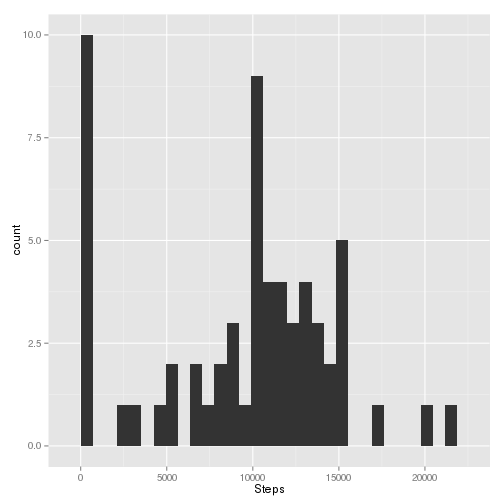
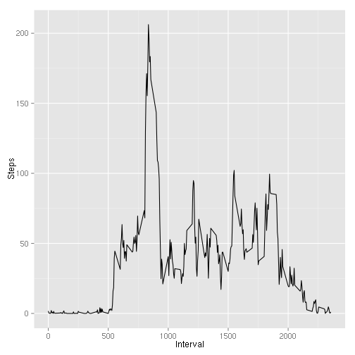
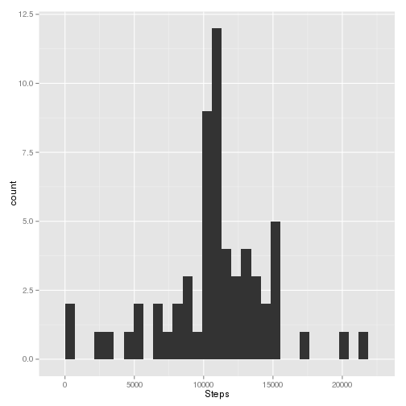

## Loading and preprocessing the data

Setup


```r
library(ggplot2)
```


```r
data <- read.csv('activity.csv')
```

## What is mean total number of steps taken per day?


```r
stepsPerDay <- aggregate(list(Steps=data$steps), list(Date=data$date), sum, na.rm = T)
ggplot(data=stepsPerDay, mapping = aes(Steps)) + geom_histogram(binwidth=706)
```

 

mean and median steps per day:


```r
medianSteps <- median(stepsPerDay$Steps)
meanSteps <- mean(stepsPerDay$Steps)
medianSteps
```

```
## [1] 10395
```

```r
meanSteps
```

```
## [1] 9354.23
```

## What is the average daily activity pattern?

Average number of steps per interval:


```r
avgStepsByInterval <- aggregate(list(Steps=data$steps), list(Interval=data$interval), mean, na.rm = T)
ggplot(data=avgStepsByInterval, mapping = aes(x=Interval, y=Steps)) + geom_line()
```

 

max number of steps:


```r
max(avgStepsByInterval$Steps)
```

```
## [1] 206.1698
```

## Imputing missing values

Total number of rows with missing values:


```r
nrow(data[!complete.cases(data),])
```

```
## [1] 2304
```

Set `NA`s to the mean of each interval and create a new histogram


```r
data2 <- data
for (x in 1:nrow(data2)){
    vec <- data2[x,]
    if(is.na(vec$steps)){
        data2[x,]$steps <- avgStepsByInterval[avgStepsByInterval$Interval == vec$interval,]$Steps
    }
}
stepsPerDay <- aggregate(list(Steps=data2$steps), list(Date=data2$date), sum, na.rm = T)
g <- ggplot(data=stepsPerDay, mapping = aes(Steps))
g + geom_histogram(binwidth=706)
```

 

New median and mean

mean and median steps per day:


```r
median(stepsPerDay$Steps)
```

```
## [1] 10766.19
```

```r
mean(stepsPerDay$Steps)
```

```
## [1] 10766.19
```

## Are there differences in activity patterns between weekdays and weekends?
